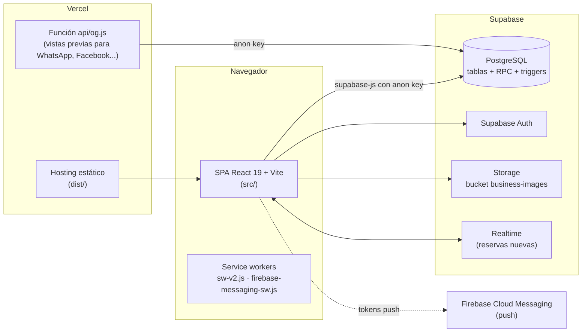

# 2. Arquitectura

## Resumen

TurnitosLR es una **SPA (single page application) en React** que habla **directamente con Supabase** desde el navegador. No hay un backend propio: toda la lógica de negocio (validaciones, cálculo de comisiones, límites de plan, login) corre en el navegador, salvo algunas funciones y triggers de PostgreSQL. La única función de servidor propia es `api/og.js` en Vercel, que sirve las vistas previas al compartir links.



## Stack

| Capa | Tecnología | Notas |
|---|---|---|
| UI | React 19, React Router 7 (`BrowserRouter`) | Páginas con carga diferida (`lazy`) y reintento si falla un chunk tras un deploy |
| Build | Vite 7, `vite-plugin-pwa` (modo `injectManifest`), Terser | Chunks manuales: `react-vendor`, `motion`, `maps`, `charts` |
| Estado global | Zustand 5 (`src/stores/`) | Solo en el panel del negocio; el resto usa estado local |
| Animaciones | Framer Motion | |
| Mapas | Leaflet / React-Leaflet | |
| Gráficos | Recharts | |
| Tipografía | Plus Jakarta Sans (local vía `@fontsource`) + Inter y Outfit (Google Fonts) | |
| Estilos | CSS global (`src/index.css`) + **estilos inline** en la mayoría de los componentes | Variables CSS para temas claro/oscuro |
| Datos | Supabase (Postgres, Auth, Storage, Realtime) | Proyecto `pjtakqbegttsazhkcsmv` |
| Push | Firebase Cloud Messaging | Proyecto `turnitos-lr-notif-777` |
| Hosting | Vercel | Dominio `turnitoslr.com` y subdominios por negocio |

> El `README.md` original menciona GitHub Pages y `HashRouter`: quedó desactualizado. Todavía existen restos de esa etapa (`deploy.ps1`, script `npm run deploy`, `VITE_BASE_PATH`, modo demo), ver [Deuda técnica](07-deuda-tecnica.md).

## Estructura de carpetas

```
api/og.js                  Función serverless de Vercel: HTML con meta tags Open Graph para bots
public/                    Imágenes de negocios demo, manifest PWA, service workers, sitemap.xml, robots.txt
scripts/                   generateSitemap.js (corre en cada build), seeds, scripts legacy
supabase/migrations/       Migraciones SQL (mezcladas con scripts de debug, fix y seed)
supabase/seed-data/        SQL para cargar negocios de prueba por categoría
migrations/                Otras migraciones sueltas (tienda, venue, booking fields)
*.sql (raíz)               Scripts SQL sueltos ejecutados a mano en el SQL Editor de Supabase
backups/                   Instrucciones de backup (los JSON no se suben al repo)
src/
  main.jsx                 Punto de entrada: fuentes, CSS, registro condicional del service worker
  App.jsx                  Router, layout, manejo de subdominios, ErrorBoundary
  pages/                   Pantallas de primer nivel (una por ruta)
  components/
    business/              Panel del negocio: modales de reserva, login, sidebar, settings/*, portal/*
    calendars/             Calendarios: SlotCalendar (turnos) y PeriodCalendar (alquileres)
    profile/               Bloques del perfil público (hero, historias, tienda, reserva de venue)
    venue/                 Configuración y perfil público de alquileres, cupones, link in bio
    seller/                Login unificado, panel de vendedor y panel Super Admin (tabs/)
    business-forms/        Formularios de alta por rubro (deportes, servicios, alquileres)
    analytics/             Gráficos y métricas
    common/                Componentes compartidos (dropdown, mapa, íconos de comodidades, cupón)
    notifications/         Toast, ConfirmDialog, AlertDialog (vía NotificationContext)
  services/
    supabaseClient.js      Cliente Supabase único
    serviceAdapter.js      Proxy: Supabase en producción, mockService en modo demo
    supabaseService.js     Fachada que reúne los servicios de supabase/*
    supabase/*.js          Acceso a datos por dominio (negocios, reservas, recursos, vendedores, etc.)
    pushService.js         Firebase Cloud Messaging + avisos en vivo
    analyticsService.js    Cálculo de métricas para el panel
  stores/                  Zustand: useAuthStore, useBookingsStore, usePortalUIStore
  utils/                   Fechas, slugs/subdominios, planes y comisiones, imágenes, promociones
  contexts/                NotificationContext (toasts y diálogos)
  data/                    Datos de ejemplo para el modo demo
```

## Rutas

Definidas en `src/App.jsx`. Las rutas fijas van **antes** de `/:businessSlug` para que no se confundan con un negocio.

| Ruta | Pantalla | Acceso |
|---|---|---|
| `/` | `Home` (marketplace) | Público |
| `/ayuda`, `/negocios`, `/colaboradores`, `/terminos`, `/privacidad` | Páginas institucionales | Público |
| `/login` | `SellerLogin` (login unificado) | Público |
| `/portal`, `/business-portal` | `BusinessPortal` | Dueño de negocio |
| `/calificar/:token`, `/review/:token` | `SubmitReview` | Cliente con link |
| `/:businessSlug`, `/:businessSlug/turnos` | `BusinessProfileRouter` → `BusinessProfile` o `VenueProfile` | Público |
| `/:businessSlug/tienda` | `BusinessStore` | Público |
| `/:businessSlug/bio` | `LinkBio` | Público |
| `/admin`, `/admin/login` | Redirigen a `/login` | |
| `/admin/super` | `SuperAdminDashboard` | Super Admin (`ProtectedSuperAdminRoute`) |
| `/admin/dashboard`, `/admin/businesses`, `/admin/businesses/new`, `/admin/businesses/:id/edit`, `/admin/commissions` | Panel del vendedor | Vendedor (`ProtectedSellerRoute`) |

> Ojo: las rutas protegidas solo verifican que exista una clave en `localStorage` (`seller` o `superAdmin`), no una sesión real. Ver [Seguridad](06-seguridad-y-riesgos.md).

### Subdominios por negocio

`getSubdomain()` (`src/utils/utils.js`) detecta `mi-negocio.turnitoslr.com` (y `www.mi-negocio.turnitoslr.com`, que redirige sin `www`). Se ignoran `www`, `admin`, `app`, `portal` y `api`. Con subdominio, `App.jsx` usa un layout aparte:

| URL | Pantalla |
|---|---|
| `mi-negocio.turnitoslr.com/` | `LinkBio` |
| `mi-negocio.turnitoslr.com/turnos` | `BusinessProfileRouter` |
| `mi-negocio.turnitoslr.com/tienda` | `BusinessStore` |

En desarrollo funciona igual con `mi-negocio.localhost:5174`.

### Cómo se busca un negocio por slug

`getBusinessBySlug` busca por la columna `slug`; `findBusinessBySlug` (utils) además acepta el nombre convertido a slug y comparaciones sin guiones, para que `padelarena` y `padel-arena` lleguen al mismo negocio.

### Cómo se decide el tipo de perfil

En `BusinessProfileRouter.jsx`:

1. Es **servicio** si `type === 'service'`, si la categoría contiene belleza/estética/spa/salud/mascota/peluquería/barber, o si tiene servicios o profesionales cargados.
2. Es **deporte** si `type === 'sport'`, si la categoría contiene deport/cancha/pádel/fútbol/tenis, o si tiene canchas.
3. Es **alquiler** solo si **no** es servicio ni deporte y además `type` es `alquiler`/`venue` o la categoría o el slug contienen quincho/salón/finca/alquiler.

Alquiler → `VenueProfile`. Todo lo demás → `BusinessProfile`. Como depende de palabras clave, **un nombre de categoría nuevo puede mandar un negocio a la pantalla equivocada**: conviene confiar solo en `businesses.type`.

## Capa de datos

```
Componente  →  serviceAdapter  →  supabaseService (fachada)  →  services/supabase/<dominio>.js  →  Supabase
                      └── (modo demo) → mockService (datos de src/data/)
```

- `serviceAdapter` decide el modo por `VITE_DEMO_MODE` o si el dominio es `github.io`. En producción siempre es Supabase.
- Muchos componentes del panel Super Admin y vendedor importan `supabaseService` directamente, salteando el adapter.
- Hay **dos generaciones de modelo de recursos** conviviendo: tablas viejas (`courts`, `services`, `specialists`) y la tabla unificada `resources`. El código escribe en ambas y traduce IDs viejos a nuevos vía `resources.metadata.original_id`. Ver [Base de datos](03-base-de-datos.md#modelo-de-recursos-convivencia-de-dos-modelos).
- Mucha configuración del negocio vive en la columna JSON `businesses.metadata` (cupones, días especiales, productos de tienda, historias, plantillas de WhatsApp...). `patchBusiness` separa qué campos van a columnas reales (lista `VALID_COLUMNS`) y cuáles a `metadata`.

## Estado global (Zustand)

| Store | Responsabilidad |
|---|---|
| `useAuthStore` | Sesión del dueño de negocio: login, auto-login desde `localStorage`, negocio actual, cambio de contraseña obligatorio |
| `useBookingsStore` | Reservas del negocio actual, reprogramación, suscripción a Realtime y alerta de reserva nueva |
| `usePortalUIStore` | Vista activa del panel (calendario, lista, analytics…) y estado de modales |

### Claves de `localStorage` / `sessionStorage` usadas

| Clave | Uso |
|---|---|
| `business` | Negocio "actual" (sesión del dueño). **También lo escribe la página pública de cada negocio** — ver Seguridad |
| `businessId`, `turnitos_business_email`, `turnitos_must_change_password` | Sesión del dueño / recordarme / cambio de contraseña |
| `seller`, `superAdmin` | Sesión de vendedor y super admin |
| `turnitos_booking_source` (session) | Marca si el cliente llegó desde el marketplace (afecta la comisión) |
| `turnitos_current_theme` (session), `chunk_reload_done` (session) | Tema y control de recarga tras deploy |

## PWA y service workers

- `src/main.jsx` registra `/sw-v2.js` **solo** en rutas `/portal`, `/seller` y `/admin` (el panel se instala como app). En el resto de las páginas desregistra ese SW para que el público no quede con caché.
- `sw-v2.js` es *network-first*: siempre intenta la red y usa caché solo sin conexión. Al activarse borra todas las cachés viejas.
- `firebase-messaging-sw.js` recibe las notificaciones push en segundo plano.
- `public/registerSW.js` es un registrador alternativo que hoy **no se carga** desde ningún lado.
- `manifest.webmanifest` arranca la app en `/portal`.

## Vercel: vistas previas y sitemap

`vercel.json` tiene dos reglas:

1. Si el *user-agent* es un bot de vistas previas (WhatsApp, Facebook, Twitter, Telegram, Discord, LinkedIn, Slack, Skype), la URL se redirige a `api/og.js`, que busca el negocio en Supabase y devuelve HTML con título, descripción e imagen del negocio.
2. Todo lo demás se sirve como `index.html` (la SPA resuelve la ruta).

`npm run build` ejecuta antes `scripts/generateSitemap.js`, que arma `public/sitemap.xml` con las páginas fijas, cada negocio y su tienda (si está habilitada).

## Decisiones de diseño a tener en cuenta

- **Guardado "a ciegas" del negocio**: los ajustes mandan un `UPDATE` sin pedir la fila de vuelta y actualizan la UI de forma optimista (evita timeouts con filas pesadas).
- **Ajustes por pestaña**: cada pestaña envía solo sus campos, para no pisar datos de otra.
- **Fechas**: `bookings.date` es texto `YYYY-MM-DD` (existen datos viejos en `DD/MM/YYYY`; `analyticsService` normaliza ambos) y además existen `start_time` / `end_time` como timestamps.
- **Nombres de clientes en mayúsculas**: `createBooking` guarda `customer_name` en mayúsculas.
