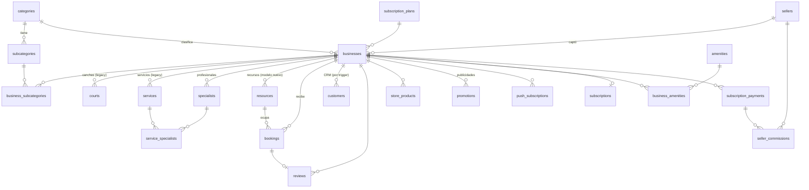

# 3. Base de datos (Supabase / PostgreSQL)

## Advertencia previa: el esquema no está completo en el repo

Las tablas centrales (`businesses`, `bookings`, `courts`, `services`, `specialists`, `service_specialists`) **se crearon a mano en Supabase** y no tienen un `CREATE TABLE` en el repositorio; solo hay `ALTER TABLE` posteriores. Además hay migraciones que se pisan entre sí (por ejemplo, `subscription_plans` se crea dos veces con columnas distintas) y muchos scripts de debug/seed mezclados con las migraciones.

**Consecuencia:** hoy no se puede reconstruir la base desde cero solo con el repo, y la fuente de verdad es la base de producción. Lo que sigue se armó leyendo migraciones **y** el código que lee/escribe cada tabla. Para tener el esquema real exacto, lo recomendable es exportarlo (ver [Desarrollo y deploy](08-desarrollo-y-deploy.md#exportar-el-esquema-real)).

## Diagrama de entidades principales



## Tablas

### `businesses` — el negocio (tabla central)
`id` es **texto** (IDs viejos tipo timestamp y UUIDs nuevos conviven), pese a que algunas tablas nuevas lo referencian como UUID.

| Grupo | Columnas |
|---|---|
| Identidad | `id`, `name`, `slug` (URL), `type` (`sport` · `service` · `alquiler`/`venue`), `category_id`, `category` (texto legacy), `description` |
| Acceso | `email`, `password` (**texto plano**, legacy), `auth_id` (usuario de Supabase Auth), `password_changed` |
| Contacto y redes | `phone`, `whatsapp`, `instagram`, `facebook`, `tiktok`, `twitter`, `youtube`, `linkedin` |
| Ubicación | `location`, `address`, `city`, `latitude`, `longitude`, `location_point` (PostGIS, se actualiza con trigger) |
| Imágenes | `logo` / `logo_url`, `banner_image` / `banner_url`, `gallery_images`, `gallery_highlights` |
| Apariencia | `theme`, `primary_color`, `button_color` |
| Operación | `hours` (JSON por día, con horario cortado), `time_ranges`, `capacity`, `max_capacity`, `sport_types`, `amenities`, `store_enabled` |
| Precios (alquiler) | `price_per_hour`, `price_per_day`, `pricing_model`, `rental_duration_options`, `additional_services`, `included_amenities` |
| Pagos | `payment_settings` (JSON), `bank_name`, `account_holder`, `cbu`, `bank_alias` |
| Suscripción | `subscription_plan_id`, `subscription_status` (`trial`/`active`/`inactive`/`cancelled`), `trial_start_date`, `trial_end_date`, `subscription_start_date`, `payment_cycle`, `seller_id` |
| Reputación | `rating`, `rating_avg`, `reviews_count` |
| Comodín | `metadata` (JSON, ver abajo) |

Estructura de `hours`:

```json
{
  "monday": { "isOpen": true, "open": "09:00", "close": "23:00",
              "isSplit": true, "breakStart": "13:00", "breakEnd": "16:00" },
  "special_days": [
    { "id": "special_…", "date": "2026-12-24", "type": "special_hours | special_price",
      "open": "10:00", "close": "14:00", "priceMode": "…", "priceVal": 20 }
  ]
}
```

> Los **días especiales** (horario especial u oferta de precio) se guardan **dentro de `hours.special_days`**, no en una columna propia. `patchBusiness` relee `hours` antes de guardar para no pisarlos.

#### Qué se guarda en `businesses.metadata`
Muchísima configuración vive en este JSON en lugar de columnas. Claves usadas por el código:

| Clave | Contenido |
|---|---|
| `booking_rules` | Políticas de reserva y cancelación (`cancellation.deadline_hours`, `cancellation.refund_policy`). La seña y los medios de pago van en la columna `payment_settings` (`deposit.enabled`, `deposit.type` porcentaje/fijo, métodos aceptados) |
| `blocked_dates` | Fechas bloqueadas (alquileres) |
| `pricing_tiers`, `duration_discounts` | Precios por cantidad de invitados y descuentos por duración (alquileres) |
| `additional_services` | Extras contratables (DJ, catering…) |
| `coupons` | Cupones de descuento (código, tipo, valor, vigencia) |
| `store_products`, `store_banners`, `store_banner_image` | Tienda: productos y banners (además existe la tabla `store_products`) |
| `venue_gallery`, historias y destacadas | Galería e historias tipo Instagram |
| `whatsapp_templates` | Plantillas de mensajes |
| botones de link in bio, `website`, `full_description` | Personalización del link in bio y perfil |
| `rating_avg`, `reviews_count` | Copia del rating (también en columnas) |

> `metadata` a veces llega "rota" (como objeto con claves `"0"`, `"1"`… por haber guardado un string como JSON). `BusinessProfileRouter` tiene una función `cleanBusinessMeta` que lo repara al leer. Conviene corregir el dato en origen.

### `bookings` — reservas

| Grupo | Columnas |
|---|---|
| Vínculos | `business_id`, `resource_id` (modelo nuevo), `court_id`, `service_id`, `specialist_id` (legacy) |
| Cuándo | `date` (texto `YYYY-MM-DD`), `time` (`HH:MM`), `duration` (min), `start_time`, `end_time` (timestamps), `end_date` |
| Cliente | `customer_name` (en mayúsculas), `customer_phone`, `customer_email` |
| Estado | `status`: `pending` · `confirmed` · `deposit_paid` · `completed` · `cancelled` · `rejected` · `blocked` (bloqueo de horario). Fechas de cada cambio: `confirmed_at`, `deposit_paid_at`, `completed_at`, `cancelled_at`, `cancellation_reason`. `history` (JSON con el historial) |
| Precio | `price`, `base_price`, `services_total`, `selected_services`, `guest_count`, `discount_type`, `discount_value`, `discount_applied`, `promo_id` |
| Comodín | `metadata`: notas, seña, `booking_source` (`marketplace`/`direct`), `commission_amount`, `plan_at_booking`, IDs crudos, token de reseña |

Realtime está habilitado en `bookings` (migración `20240101000003`): el panel recibe las reservas nuevas al instante.

### Catálogo de recursos

#### Modelo de recursos: convivencia de dos modelos
- **Legacy**: `courts` (canchas), `services` (servicios), `specialists` (profesionales) y `service_specialists` (qué profesional hace qué servicio).
- **Nuevo**: `resources` (tabla unificada: `type` = `court` · `service` · `venue` · `additional`, con `base_price`, `duration_minutes`, `buffer_minutes`, `capacity`, `consumes_space`, `active`, `metadata`).

Las migraciones `20260105000005..7` copiaron los datos viejos a `resources` guardando el ID original en `metadata.original_id` / `old_court_id` / `old_service_id`. El código actual **escribe en los dos lados** y, al crear una reserva, traduce el ID viejo al nuevo. Unificar en un solo modelo es una de las mejoras pendientes más importantes ([Deuda técnica](07-deuda-tecnica.md)).

### Clasificación
- `categories`: rubros (Deportes, Belleza, Salud, Alquileres, Mascotas), con `business_type`, ícono, color y orden.
- `subcategories`: por categoría (pádel, fútbol, peluquería, quincho…).
- `business_subcategories`: relación negocio ↔ subcategorías.
- `amenities` y `business_amenities`: comodidades (pileta, parrilla, wifi…).

### Clientes, reseñas y tienda
- `customers`: CRM por negocio, clave única `(business_id, phone)`. **Se llena sola** con el trigger `trigger_sync_booking_to_customers` en cada alta o cambio de reserva. Tiene `notes` y `tags`.
- `reviews`: `rating` 1–5, `comment`, `token` único para el link de calificación, `status` (`pending`/`approved`/`rejected`), vínculo opcional a `booking_id`.
- `store_products`: productos de la tienda (`name`, `price`, `category`, `image_url`, `is_active`, `sort_order`).

### Publicidad y notificaciones
- `promotions`: publicidades/banners del carrusel de la home (y promos por negocio), con vigencia y estado. Se gestionan desde Super Admin → "Publicidades Home".
- `push_subscriptions`: tokens de Firebase por negocio.

### Suscripciones y vendedores
- `subscription_plans`: catálogo de planes en la base. **Ojo:** el código usa principalmente un catálogo propio en `src/utils/subscriptionUtils.js` con IDs de texto (`free`, `services_individual`, `courts_1_3`…), que no coincide con esta tabla. Ver [Planes y comisiones](05-planes-y-comisiones.md).
- `subscriptions`: suscripción por negocio con `spaces_included` / `spaces_used` (los triggers de límite de espacios usan esta tabla).
- `subscription_payments`: pagos registrados (manuales; no hay pasarela).
- `sellers`: vendedores/colaboradores (`password` en texto plano en la tabla, aunque el login usa Supabase Auth con `auth_id`).
- `seller_commissions`: comisiones calculadas por pago.
- `super_admins`: administradores. La migración inserta `admin@turnitoslr.com` con contraseña `superadmin123` (ver Seguridad).

### Analytics
- `bookings_analytics`: copia de reservas para métricas, alimentada por el trigger `trigger_sync_booking_to_analytics` (si está instalado; hay varias versiones de "fix" de ese trigger).

## Funciones (RPC) y triggers

| Nombre | Tipo | Qué hace | ¿Lo usa el frontend? |
|---|---|---|---|
| `check_business_availability(business, start, end)` | RPC | Verifica capacidad total del negocio en un rango | Sí, al crear reserva |
| `check_resource_availability(resource, start, end, exclude)` | RPC | Verifica solapamiento en un recurso | Sí |
| `get_nearby_businesses(lat, lng, radius)` | RPC | Negocios cercanos (PostGIS) | Sí, "cerca mío" |
| `upsert_specialists(...)` | RPC `SECURITY DEFINER` | Guarda profesionales salteando RLS | Sí |
| `login_business(email, password)` | RPC `SECURITY DEFINER` | Login contra contraseña en texto plano. **Tiene un error de sintaxis** (`IFFOUND`) y no se usa | No |
| `check_specialist_availability`, `can_reschedule_booking` | RPC | Disponibilidad de profesional / reprogramación | No (la lógica está duplicada en JS) |
| `sync_booking_to_customers` | Trigger en `bookings` | Mantiene el CRM | — |
| `sync_booking_to_analytics` | Trigger en `bookings` | Llena `bookings_analytics` | — |
| `validate_buffer_time` | Trigger | Respeta el tiempo entre turnos de un recurso | — |
| `validate_space_limit`, `update_subscription_spaces_used` | Triggers en `resources`/`specialists` | Impiden superar los espacios del plan | — |
| `update_location_point` | Trigger en `businesses` | Calcula `location_point` desde lat/long | — |

## Storage

- Bucket **`business-images`** (público): logos, banners, galería, historias, productos. Se sube desde `storageService.uploadImage` con nombre aleatorio.
- También hay imágenes de negocios demo en `public/` (pesan ~23 MB en total y se incluyen en cada build).

## Seguridad a nivel de filas (RLS)

En el repo solo hay políticas para `reviews`, `push_subscriptions`, `amenities`/`business_amenities`, `promotions` y `store_products`, y **casi todas permiten todo** (`USING (true)`). Para `businesses`, `bookings`, `customers`, `sellers`, `super_admins`, etc. no hay políticas versionadas. Como el navegador usa la clave pública (`anon`), **el estado real de RLS en producción hay que verificarlo en Supabase**. Ver el detalle y la consulta para revisarlo en [Seguridad](06-seguridad-y-riesgos.md#4-la-base-de-datos-probablemente-está-abierta).
