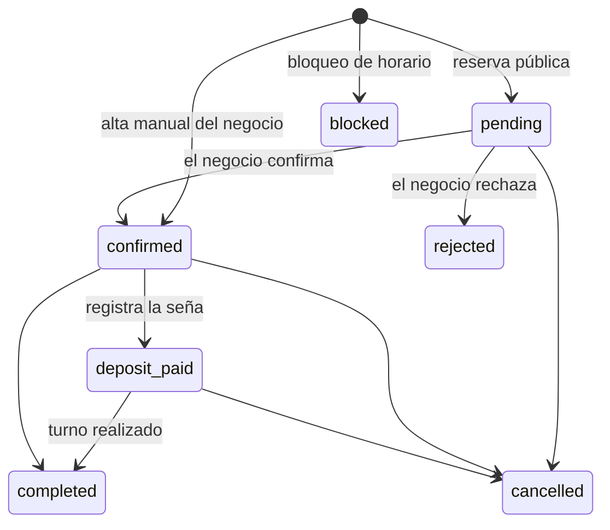
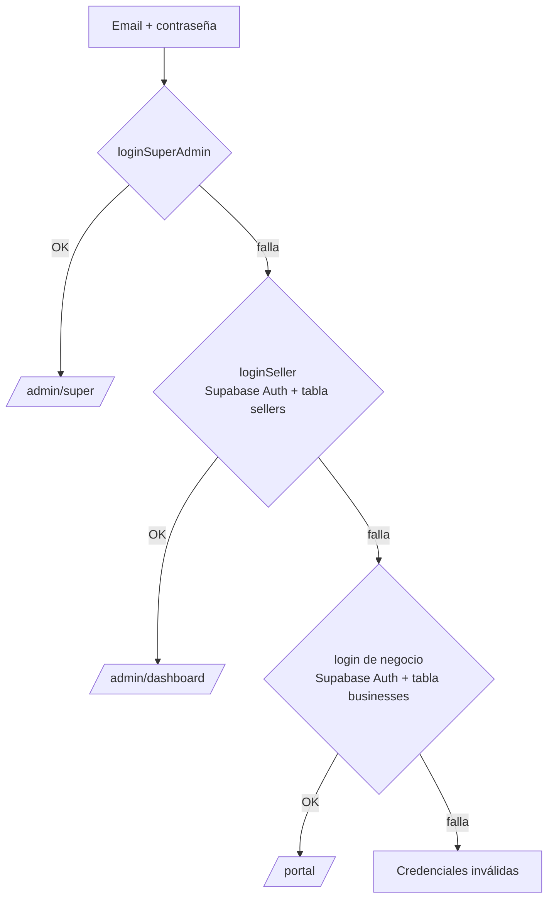

# 4. Flujos principales

Cada flujo indica qué archivos intervienen, para encontrar rápido el código.

## Reservas

Todas las reservas públicas terminan en `createBooking` (`src/services/supabase/bookingService.js`), que:

1. Traduce el ID viejo de cancha/servicio al ID de `resources` (si existe).
2. Arma `start_time` / `end_time` a partir de fecha, hora y duración.
3. Busca reservas que se superpongan en el mismo recurso (ignora `cancelled` y `rejected`) → error "Este turno ya está reservado".
4. Llama al RPC `check_business_availability` (capacidad total del negocio).
5. Si el negocio está en **plan gratis**, corta al llegar a **100 reservas en el mes**.
6. Calcula la **comisión** de la plataforma según plan y origen (`marketplace` o `direct`) y la guarda en `metadata.commission_amount`.
7. Valida que los IDs de servicio/cancha/profesional existan y guarda la reserva en estado **`pending`**.

Después, la pantalla pública: suma 1 al uso del cupón (si se usó), dispara el aviso al negocio (`pushService.notifyBusinessNewBooking`) y muestra el modal de éxito.

> Toda esta lógica corre en el navegador del cliente. Ver en [Seguridad](06-seguridad-y-riesgos.md) por qué eso es un riesgo (se puede saltear validaciones, límites y comisiones).

### Origen de la reserva (marketplace vs. directa)
Si el cliente entra a un negocio **desde la home**, `Home.jsx` guarda `turnitos_booking_source = marketplace` en `sessionStorage`. Si llega por el link directo, el subdominio o el link in bio, la reserva queda como `direct`. Esto define si se cobra comisión ([Planes y comisiones](05-planes-y-comisiones.md)).

### Deportes (canchas)
`BusinessProfile.jsx` + `PadelBookingFlow`, `PadelTimeline` / `PadelMobileATC`, `CourtSelector`, `DurationSelector`, `BookingSummary`.
El cliente elige fecha → ve la grilla de canchas por horario (respeta horario de apertura, horario cortado y días especiales) → elige cancha, hora y duración → completa nombre y teléfono → confirma.

### Servicios (peluquería, estética, salud…)
`BusinessProfile.jsx` + `ServiceSelector`, `ProfileSpecialistSelector`, `TimeSlotPicker`, `BookingSummary`.
El cliente elige servicio → profesional (solo los asignados a ese servicio vía `service_specialists`; o "cualquiera") → fecha y horario disponible del profesional (respeta duración del servicio y tiempo entre turnos) → datos → confirma.

### Alquileres (quinchos, salones)
`VenueProfile.jsx` + `VenueBookingPanel`, `VenueBookingWizardModal` (asistente de 4 pasos), `PeriodCalendar`, `CouponInput`.
El cliente elige fechas en el calendario (las bloqueadas no se pueden elegir) → duración/modalidad (por hora o por día) → cantidad de invitados (puede cambiar el precio por `pricing_tiers`) → servicios adicionales → cupón → datos y confirmación. Se muestra la seña configurada y los datos bancarios.

### Gestión de la reserva por el negocio
`BusinessPortal.jsx`, `BookingDetailsModal.jsx`, `NewBookingModal.jsx`, `BlockSlotModal.jsx`.

Cada cambio queda en `bookings.history`. La cancelación consulta la política (`booking_rules.cancellation`) para advertir sobre el plazo y el reintegro. Desde el detalle se puede escribir al cliente por WhatsApp con mensajes armados, y reprogramar (mover fecha/hora/recurso).

## Login

Un solo formulario en `/login` (`src/components/seller/SellerLogin.jsx`) prueba en este orden:

- Lo que se guarda tras el login es el objeto completo en `localStorage` (`superAdmin`, `seller` o `business`). Las rutas protegidas solo chequean que esa clave exista.
- **Dueño de negocio**: intenta Supabase Auth; si el usuario de Auth no existe todavía, lo crea en ese momento (`signUp`) y guarda `auth_id`. Si `password_changed` es falso, obliga a cambiar la contraseña.
- `/portal` tiene además su propio formulario (`BusinessLogin.jsx`) y un **auto-login** (`useAuthStore.checkAutoLogin`) que usa lo guardado en `localStorage`.

> ⚠️ Este flujo tiene fallas graves (se puede entrar sin contraseña correcta). Están explicadas en [Seguridad](06-seguridad-y-riesgos.md#1-se-puede-entrar-a-cualquier-panel-sin-la-contraseña).

## Alta de un negocio

Puede hacerla el **Super Admin** (`BusinessFormModal.jsx` → `createBusinessAsSuperAdmin`) o un **vendedor** (`SellerBusinessForm.jsx` → `createBusinessBySeller`, que además asigna `seller_id`).

1. Se elige el rubro y se completa un formulario específico (`business-forms/DeportesForm`, `ServiciosForm`, `AlquileresForm`): datos, ubicación en mapa, horarios, canchas/servicios/profesionales, plan.
2. `createBusiness` inserta en `businesses`, crea el usuario en Supabase Auth, carga subcategorías, servicios, canchas y profesionales (en tablas legacy y en `resources`) y crea la suscripción por defecto.
3. Se muestran las credenciales para pasarle al dueño (email + contraseña temporal; en el formulario del vendedor la contraseña temporal es fija: `admin123`). El dueño debe cambiarla en el primer ingreso.

El Super Admin también puede **impersonar** un negocio (entrar a su panel) y **resetear contraseñas** (genera una temporal y un mensaje para enviar por WhatsApp).

## Configuración del negocio

`BusinessSettings.jsx` (y `VenueSettings.jsx` para alquileres) con una pestaña por tema. Cada pestaña guarda solo sus campos con `patchBusiness`, que separa columnas reales de lo que va a `metadata` y relee `hours` para no perder los días especiales. Las imágenes se suben al bucket `business-images`.

## Notificaciones

Cuando entra una reserva pública, `pushService.notifyBusinessNewBooking` intenta avisar por cuatro vías:

| Vía | ¿Funciona? |
|---|---|
| `BroadcastChannel` (otras pestañas del mismo navegador) | Solo si el negocio reserva en su propio navegador |
| Canal de **Supabase Realtime** `business-notif-<id>` | Sí, si el negocio tiene el panel abierto |
| `Notification` del navegador | Solo en el navegador del **cliente** que reserva (no le sirve al negocio) |
| Push de **Firebase** a los tokens guardados | **Muy probablemente no**: llama a la API vieja de FCM (`fcm.googleapis.com/fcm/send`) sin clave de servidor, desde el navegador. Google dio de baja esa API en 2024 y además exige autenticación |

Además, el panel escucha inserts en `bookings` por Realtime (`useBookingsStore.subscribeToRealtime`) y muestra una alerta. **Conclusión:** el aviso funciona con el panel abierto; con la app cerrada, el push no llega. Para que llegue hace falta enviar el push desde un servidor (por ejemplo, una Supabase Edge Function disparada al insertar la reserva, usando la API HTTP v1 de FCM).

## Reseñas

1. Desde Super Admin → "Reseñas & Feedback" se genera un **token** para una reserva (`generateReviewToken`) y se arma un link `/calificar/<token>` para enviar por WhatsApp.
2. El cliente abre el link (`SubmitReview.jsx`), califica de 1 a 5 y comenta.
3. `submitReviewByToken` guarda la reseña y `recalculateBusinessRating` actualiza `rating_avg` y `reviews_count` del negocio.
4. El Super Admin puede moderar (rechazar o borrar).

## Tienda online

`BusinessStore.jsx` (`/:slug/tienda`), configurada en Ajustes → Tienda (`StoreTab.jsx`). Muestra banners, categorías y productos; el carrito arma un **mensaje de WhatsApp** con el pedido. No hay stock real ni cobro. Los productos están en `metadata.store_products` y/o en la tabla `store_products` (conviven ambos).

## Link in bio

`LinkBio.jsx` (`/:slug/bio` o el subdominio). Muestra perfil, redes, historias de 24 h y destacadas, botones configurables (`LinkBioButtonsSettings.jsx`), WhatsApp y ubicación.

## Publicidades de la home

Super Admin → "Publicidades Home" (`PromotionsTab.jsx`) administra los banners del carrusel (`PromotionsHero.jsx`), con segmentación, enlaces externos y formato de banner al 100 %. Se guardan en la tabla `promotions`.

## Vistas previas al compartir

Cuando alguien comparte `turnitoslr.com/mi-negocio` por WhatsApp/Facebook/etc., Vercel detecta el bot y responde con `api/og.js`: título "Negocio – Turnos Online (Categoría) | TurnitosLR", descripción, rating e imagen (banner o logo) del negocio.
